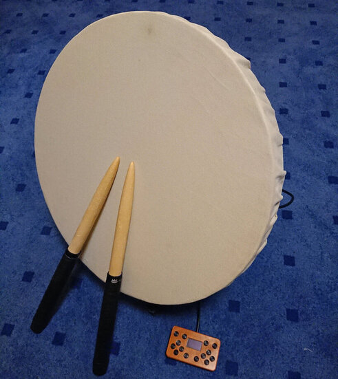

# DonCon2040 - A RP2040 based Taiko no Tatsujin arcade controller

DonCon2040 is a firmware (and by extension a PCB) for DIY Taiko no Tatsujin arcade drum controllers based on the RP2040 microcontroller.

Big disclaimer: I've never played on or even touched a real arcade drum, so everything in this project is based on information I could scrape of the internet.

The firmware is pretty much tailored to this specific use case, if you are looking for something universal, ready-to-flash and on-the-fly configurable I'd recommend to have a look at more general approaches like [GP2040-CE](https://github.com/OpenStickCommunity/GP2040-CE). If you however want build something more specialized or custom, feel free to use this project as a base, it is designed to be somewhat modular to be easily remodeled. See [DivaCon2040](https://github.com/ravinrabbid/DivaCon2040) for an example on how this could look like.



## Features

- Various controller emulation modes
  - HORI PS4-095 Taiko Drum for PS4*
  - HORI NSW-079 Taiko Drum for Switch
  - Dualshock 4*
  - Dualshock 3
  - Switch Pro Controller
  - XInput
  - Keyboard
  - MIDI
  - Debug mode (will output current state via USB serial)
- Additional buttons via external i2c GPIO expander
- Basic configuration via on-screen menu on attached OLED screen
- Single WS2812 LED for trigger feedback
- Drumroll counter on display

*: Will not work properly on an actual PS4 since there are measures to prevent unauthorized accessories from being used.

## Building

See [pico-sdk readme](https://github.com/raspberrypi/pico-sdk/blob/master/README.md#quick-start-your-own-project) for a list of pre-requisites.

```sh
git submodule update --init
git -C libs/pico-sdk submodule update --init
mkdir build && cd build
cmake ..
make
```

If you want to use a local pico-sdk distribution instead of using git submodule, also see [pico-sdk readme](https://github.com/raspberrypi/pico-sdk/blob/master/README.md#quick-start-your-own-project) for alternatives.

## Configuration

Few things which you probably want to change more regularly can be changed using an on-screen menu on the attached OLED display, hold both Start and Select for 2 seconds to enter the menu:

- Controller emulation mode
- LED brightness
- Trigger thresholds
- Hold Time
- Enter BOOTSEL mode for firmware flashing

Those settings are persisted to flash memory if you choose 'Save' when exiting the Menu and will survive power cycles.

Defaults and everything else are compiled statically into the firmware. You can find everything in `include/GlobalConfiguration.h`. This covers default controller emulation mode, i2c pins, external ADC configuration, addresses and speed, default trigger thresholds, scale and debounce delay, button mapping, LED colors and brightness.

### Debounce Delay / Hold Time

The debounce delay also implicitly serves as the hold time of the input after a hit. On some platforms inputs won't be registered properly if this time is too short. For example Taiko no Tatsujin on Switch needs at least 25 milliseconds.

If you notice dropped inputs even if the controller signals a hit on the LED/Display, try to increase this value.

## Hardware

### IO Board

The [DonConIO](/pcb/DonConIO) board in the pcb subfolder is designed to be close to the original arcade hardware. It hosts a Seeed Studio XIAO RP2040 and provides signal conditioning for Sensatec GSS-4S* piezo impact sensors. See its [README](/pcb/DonConIO/README.md) for details.

If you don't want to use this board, the firmware should be usable on most RP2040 boards with appropriate configuration. You may also use a more simple trigger solution, it only has to provide an analog trigger level to the ADC inputs to be compatible.

### Controller Buttons and Display

Additional controller buttons and the display are attached to the same (or different if your board has more than one) i2c bus. For the display, use a standard SSD1306 OLED display with 128x64 resolution. The buttons need to be attached to a MCP23017 IO expander.

See [DonConPad](/pcb/DonConPad/) for a exemplary gamepad pcb.

Mind that currently the display and buttons are mandatory to use the controller.

### Physical construction

I'll only give a rough outline of the physical construction since I'm still not completely happy with its performance and I'm still experimenting with some alternatives:

- The pads are made of 12mm thick multiplex boards. The outer diameter is ~42cm, the inner diameter is ~35cm.
- Pads are mounted to another 20mm multiplex board with rubber dampeners. The backplates on the arcade drum seem to be thinner, but since those are sturdily mounted to the arcade machine, I figured some more mass couldn't hurt.
- The rubber dampeners are 15mm of height and 20mm in diameter. The arcade drum seems to use tapered dampeners, but at least the tapered dampeners I could get my hands on felt too soft, so I went with straight ones.
- For the drum skin I went with a 2mm natural rubber sheet covered by some canvas.

## Acknowledgements

- [daschr](https://github.com/daschr) for the [SSD1306 OLED driver](https://github.com/daschr/pico-ssd1306)
- [FeralAI](https://github.com/FeralAI) for the inspiration and XInput driver from the [GP2040 Project](https://github.com/FeralAI/GP2040)
- The linux kernel contributors for documenting the game controllers in their drivers
